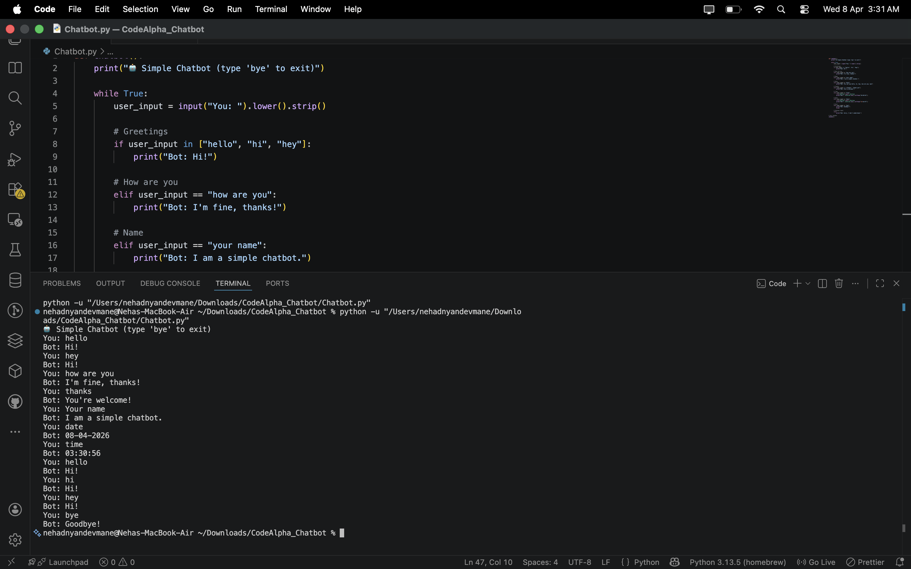

Basic Chatbot

📌 Description

This is a simple rule-based chatbot built using Python.
It responds to user inputs like greetings and basic questions using predefined replies.

🚀 Features

Responds to inputs like hello, hi, hey
Handles "how are you" and "bye"
Additional replies for help, thanks, and name
Shows current time and date
Simple console-based interaction

🛠️ Technologies Used

Python

▶️ How to Run

python Chatbot.py

📷 Output

